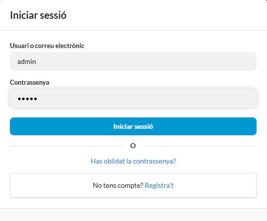

# TimeOut — Frontend

> Sports club management platform · React + TypeScript

TimeOut is a full-stack web platform built to help sports clubs manage their operations digitally: members, teams, events, ticket sales, merchandise, and more. This repository contains the **frontend** — a React + TypeScript application that includes both the public-facing club website and the admin management panel.

---

## Live Demo

🔗 [timeout-project.vercel.app](https://timeout-project.vercel.app)

> Frontend: Vercel · Backend: Render · Database: Aiven (MySQL)

---

## Try the Admin Panel

The platform includes a full administration panel. To explore it, log in with the demo credentials:

| Field | Value |
|---|---|
| User | `admin` |
| Password | `admin` |



Once logged in, click the **PANELL** button in the top navigation bar to access the admin panel.


---

## Features

**Admin panel**
- Dashboard with latest registered members, purchases and ticket sales
- Member, player, coach and staff management
- Team management with division, category and sport classification
- Event and match creation with configurable ticket capacity and pricing
- In-person ticket sales from the admin panel (box office)
- Merchandise shop management: products, categories, sizes and stock
- News publishing with rich text editor (TinyMCE)
- Sponsor management
- Customisable role and permission system per admin user
- Bulk and transactional email sending with customisable templates
- Payment and shipping order tracking

**Public website**
- Upcoming matches listing with ticket purchase flow
- Stripe-powered checkout for tickets, memberships and shop products
- PDF invoice download after purchase
- QR code generation and email delivery for purchased tickets
- Merchandise shop with category filtering and shopping cart
- News section
- Team and player profiles
- User registration with email activation, login and password recovery
- Member (soci) sign-up with Stripe payment

---

## Tech Stack

| Layer | Technology |
|---|---|
| Language | TypeScript |
| UI library | React 18 |
| Component library | Semantic UI React |
| Routing | React Router DOM |
| Forms | Formik |
| Payments | Stripe (`@stripe/react-stripe-js`) |
| PDF generation | `@react-pdf/renderer` |
| QR generation | `qrcode.react` |
| Rich text editor | TinyMCE (`@tinymce/tinymce-react`) |
| Styles | SCSS |
| State management | Context API |
| HTTP client | Fetch API |
| Testing | Jest + React Testing Library |

---

## Project Structure

```
src/
├── api/               # API call functions
├── components/
│   ├── Admin/         # Admin panel components (by feature)
│   ├── Client/        # Public website components
│   └── Common/        # Shared components (StripeForm, PDFTemplates, EmailTemplates...)
├── context/           # Global state (Context API)
├── hooks/             # Custom hooks
├── layouts/
│   ├── AdminLayout/
│   └── ClientLayout/
├── pages/
│   ├── admin/
│   └── client/
├── routes/            # Route definitions
├── scss/              # Global styles and Semantic UI overrides
└── utils/             # Helper functions
```

---

## Related Repositories

| Repository | Description |
|---|---|
| [`timeout-backend`](https://github.com/JordiCaballeria/timeout-backend) | Django REST Framework API |
| `timeout-mobile` | React Native app for QR ticket scanning |

---

## Authors

- **Jordi Caballeria** — [github.com/JordiCaballeria](https://github.com/JordiCaballeria)
- **Isaac González**

---

## Awards

🏆 **1st Prize — Best Entrepreneurship Project**, 4th edition of the *Premios ImpulsFP* (2023)
